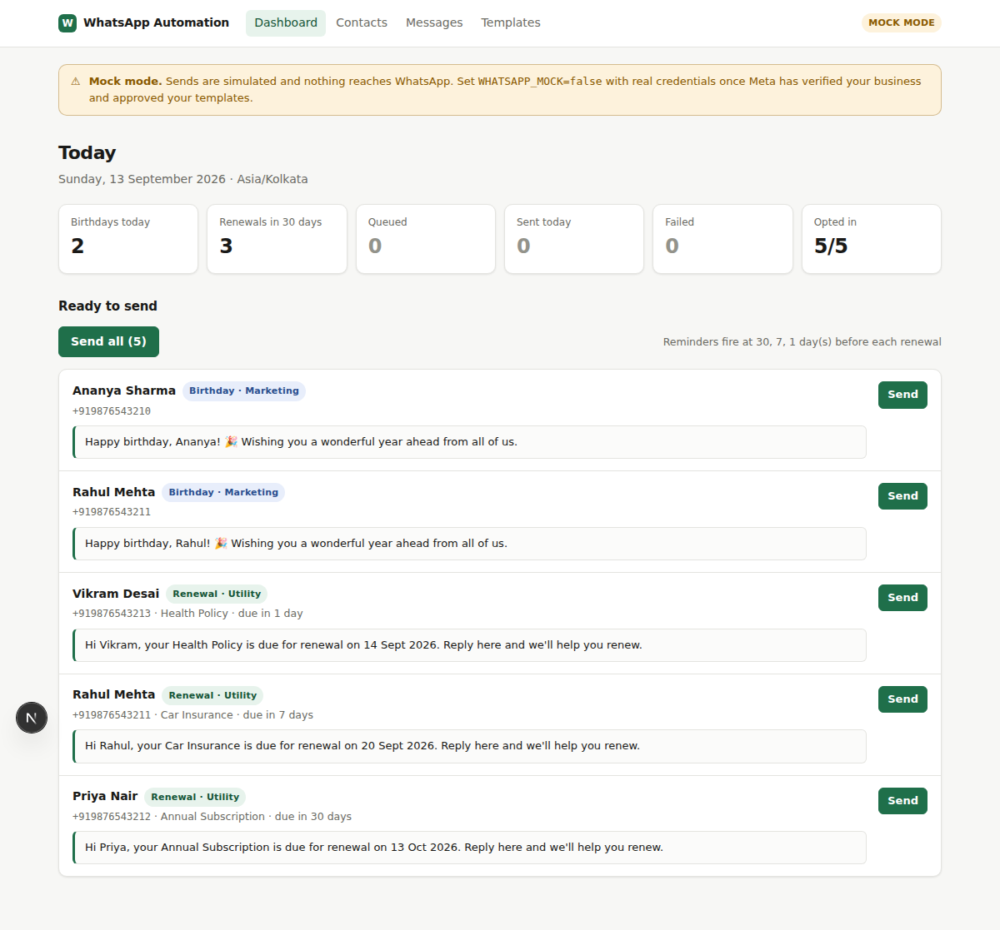

# WhatsApp Automation

Send birthday wishes and renewal reminders over WhatsApp — one click from a
dashboard, or fully automatic on a daily schedule.

Built on the official **WhatsApp Cloud API**. Next.js + Postgres.

<!-- screenshots live in docs/ -->


---

## The one rule that shapes everything

WhatsApp does **not** let a business send free-form messages to people who
haven't messaged it recently. Any business-initiated message outside a 24-hour
window must use a **template that Meta has approved in advance**.

That is enforced at Meta's API, not by this app, which is why:

- there is no free-text send anywhere in this codebase;
- `templates` mirrors what you created in WhatsApp Manager — this app never
  invents a template;
- a contact with no recorded opt-in can't be messaged at all.

Your two use cases fall into different template categories, and this matters
for cost:

| Use case | Category | Notes |
|---|---|---|
| Renewal reminder | **Utility** | Much cheaper; free inside an open 24-hour service window |
| Birthday wish | **Marketing** | Pricier, stricter on opt-in, first to hurt your quality rating |

Check the [current rate card](https://business.whatsapp.com/products/platform-pricing) —
Meta moved to per-message pricing in mid-2025 and rates change.

---

## Quick start (mock mode — no Meta account needed)

Everything works before Meta has verified anything. `WHATSAPP_MOCK=true` simulates
sends so you can build and demo the whole flow.

```bash
npm install
cp .env.example .env.local          # defaults are fine for local work
createdb wa_automation              # or point DATABASE_URL at an existing server

npm run db:migrate                  # apply db/schema.sql (idempotent)
npm run db:seed                     # 2 templates + 5 demo contacts with renewals

npm run dev                         # http://localhost:3000
npm run worker                      # in a second terminal — drains the queue
```

Open the dashboard: today's birthdays and due renewals are listed with a preview
of the exact message and a **Send** button each, plus **Send all**.

---

## Going live

### 1. Meta setup (done once, on Meta's side)

1. Create a Meta Business account and complete **business verification**
   (needs business documents; allow a few days).
2. Add the **WhatsApp** product to a Meta app.
3. Register a phone number that is **not** already in use on regular WhatsApp
   or WhatsApp Business. Registering it here is one-way.
4. In **WhatsApp Manager → Message templates**, create your templates. Start with:

   | Name | Category | Body |
   |---|---|---|
   | `birthday_wish_v1` | Marketing | `Happy birthday, {{1}}! 🎉 Wishing you a wonderful year ahead.` |
   | `renewal_reminder_v1` | Utility | `Hi {{1}}, your {{2}} is due for renewal on {{3}}. Reply here and we'll help you renew.` |

   Approval usually takes minutes to a day.
5. Create a **System User** and generate a permanent access token with
   `whatsapp_business_messaging` and `whatsapp_business_management`. Don't ship
   the 24-hour token from the API Setup page.

### 2. Configure this app

Fill in `.env.local` (see `.env.example` for all options):

```bash
WHATSAPP_MOCK=false
WHATSAPP_PHONE_NUMBER_ID=...
WHATSAPP_BUSINESS_ACCOUNT_ID=...
WHATSAPP_ACCESS_TOKEN=...          # system user token
WHATSAPP_APP_SECRET=...            # verifies webhook signatures
WHATSAPP_VERIFY_TOKEN=...          # any random string you choose
CRON_SECRET=...                    # required in production
```

Then mirror each approved template on the **Templates** page — the name,
language and placeholder count must match Meta exactly, and status must be
`APPROVED` before the scheduler will touch it.

### 3. Point the webhook at your deployment

In **App Dashboard → WhatsApp → Configuration**:

- Callback URL: `https://your-domain.com/api/webhook`
- Verify token: the same `WHATSAPP_VERIFY_TOKEN`
- Subscribe to the **`messages`** field.

This delivers `sent → delivered → read` status updates and inbound replies.

---

## Automatic daily sending

`POST /api/cron/scan` queues everything due today. Run it once a day, after the
hour you want messages to land (it uses `BUSINESS_TIMEZONE`, not the server's
clock).

**Vercel** — `vercel.json` is already set up: `scan` daily at 09:00 IST and
`drain` every minute.

**Anywhere else** — cron plus the long-running worker:

```cron
30 3 * * * curl -fsS -X POST https://your-domain.com/api/cron/scan \
             -H "Authorization: Bearer $CRON_SECRET"
```

Both `/api/cron/*` routes require `Authorization: Bearer $CRON_SECRET` in
production.

### Two ways to drain the queue

| | How | When to use |
|---|---|---|
| Worker | `npm run worker` | VPS, Docker, anything long-lived |
| Cron route | `POST /api/cron/drain` each minute | Serverless (Vercel) |

Both call the same `drainOnce()`. Running several workers is safe — claims use
`FOR UPDATE SKIP LOCKED`.

---

## Docker

```bash
docker compose up --build      # postgres + web + worker
docker compose exec web npm run db:migrate
docker compose exec web npm run db:seed
```

---

## How it fits together

```
contacts ─┐
renewals ─┼─► daily scan ──► messages (queue) ──► worker ──► Cloud API
templates ┘   /api/cron/scan      ▲                             │
                                  │                             ▼
              dashboard "Send" ───┘                        /api/webhook
                                                    sent│delivered│read│failed
                                                          + STOP → opt-out
```

`messages` is both the outbox and the work queue: one row per message, carrying
its status, attempt count and any error Meta returned.

---

## Things that are deliberate

**Opt-in is enforced, not advisory.** `enqueueMessage` refuses a contact without
`opt_in_at`, and `opt_in_source` is stored because Meta can ask you to produce
proof of consent.

**`STOP` is honoured immediately.** An inbound `stop` / `unsubscribe` / `cancel`
sets `opt_out_at` and cancels anything already queued for that person.

**Sends are idempotent.** Every scheduled message carries a `dedupe_key`
(`birthday:2026`, `renewal:<id>:7`) behind a partial unique index, so a cron that
fires twice — or an operator clicking Send twice — cannot double-message anyone.

**Timezones are explicit.** "Whose birthday is it today" is meaningless without
one. Civil dates are read as `YYYY-MM-DD` strings and resolved in
`BUSINESS_TIMEZONE`; the `DATE` type parser is overridden because node-pg
otherwise parses them at *local* midnight and shifts them a day.

**29 February birthdays are greeted on the 28th** in common years rather than
skipped for three years at a time.

**Retries distinguish transient from permanent.** A rate limit backs off
(3ⁿ minutes, capped at four hours); "not a WhatsApp user" fails immediately
instead of burning five attempts.

**Status only moves forward.** A late `sent` webhook can't overwrite a `read`.

**Webhooks are verified.** `X-Hub-Signature-256` is checked with a timing-safe
compare; events are deduplicated on an event key so Meta's retries are harmless.

**Template parameters are sanitised.** Meta rejects body parameters containing
newlines or 4+ consecutive spaces — a stray newline in a contact's name would
otherwise fail the send.

---

## Protecting your number

Rising block rates drop your quality rating, which throttles how many messages
you may send per day. So:

- only message people who actually opted in;
- prefer **Utility** templates — send renewal reminders, be sparing with marketing;
- give people an obvious way out and honour it instantly (this app does);
- `WORKER_RATE_PER_SECOND` paces sending; leave it modest.

> Unofficial libraries that drive WhatsApp Web with a personal number
> (`whatsapp-web.js`, Baileys) get that number **banned** at volume and violate
> WhatsApp's Terms. This app does not use them.

---

## Project layout

```
db/schema.sql              tables, indexes, triggers
src/lib/
  whatsapp.ts              Cloud API client + error classification
  queue.ts                 enqueue, claim, retry, cancel
  sender.ts                drainOnce() — shared by worker and cron
  scheduler.ts             who is due today
  templates.ts             variable binding and rendering
  dates.ts                 timezone-aware civil dates
  phone.ts                 E.164 normalisation
src/app/api/
  send/                    one-click send, and send-all
  cron/{scan,drain}/       scheduled jobs
  webhook/                 Meta delivery receipts and inbound messages
worker/index.ts            long-running queue worker
tests/                     dates, phone, template binding
```

## Commands

```bash
npm run dev         npm run build       npm start
npm run worker      npm run db:migrate  npm run db:seed
npm run typecheck   npm test
```
